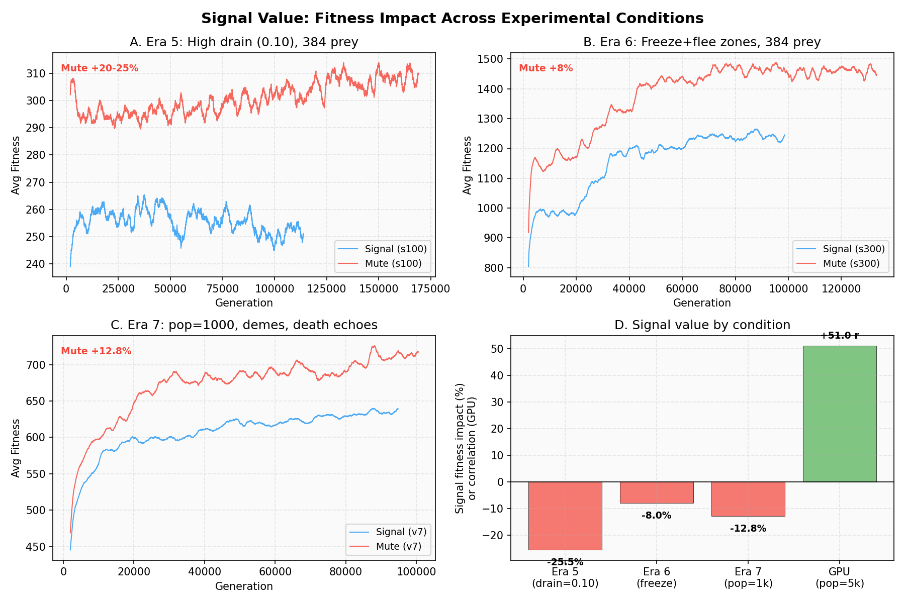
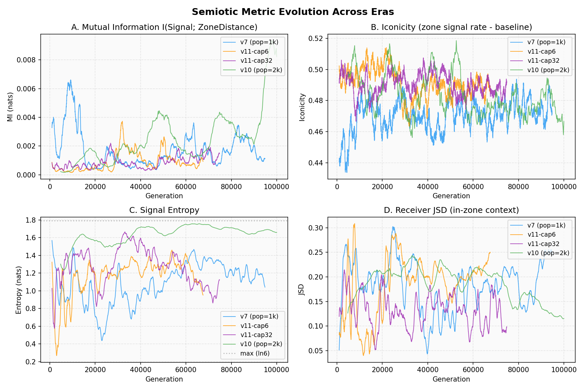
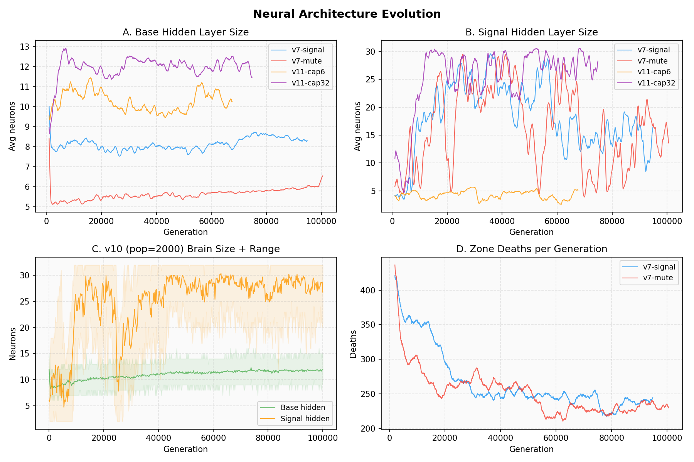
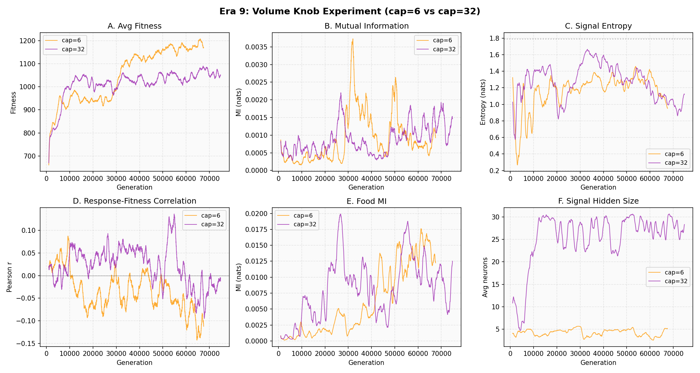
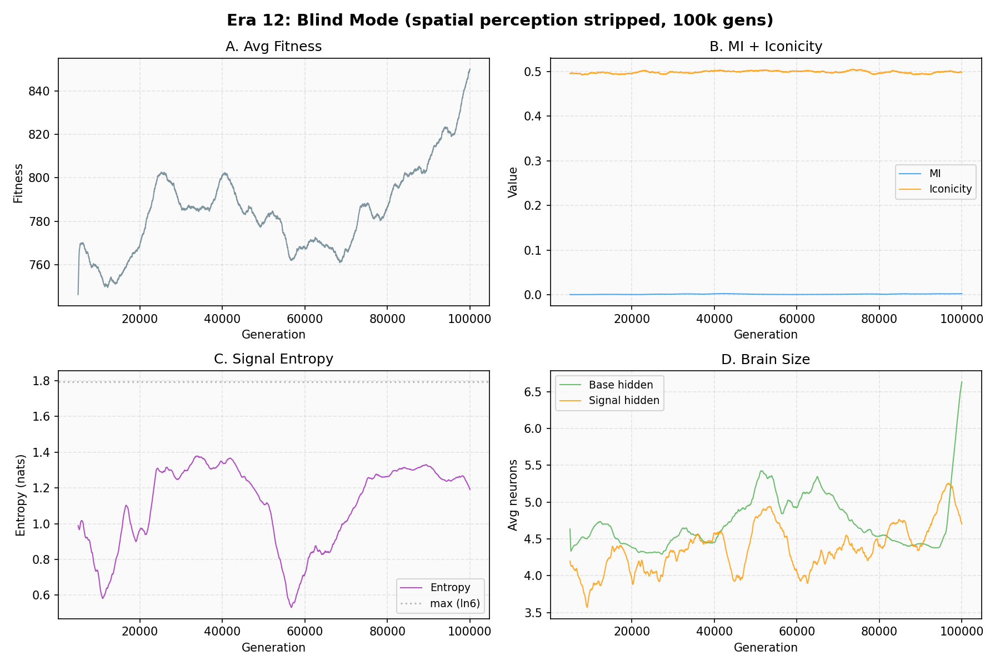
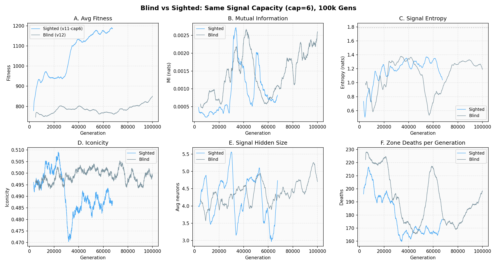

# Experiments

Chronological lab notebook for semiotic-emergence. Each era documents what we tested, what we found, and what we changed in response. For standing conclusions and the evidence hierarchy, see [FINDINGS.md](FINDINGS.md).

## Table of Contents

- [Run Registry](#run-registry)
- [Era 1: Baseline](#era-1-baseline-20x20-48-prey-fixed-brain) - 20x20, 48 prey, fixed brain
- [Era 2: 8x Scale](#era-2-8x-scale-56x56-384-prey-evolvable-brain) - 56x56, 384 prey, evolvable brain
- [Era 3: Architecture v2](#era-3-architecture-v2) - Split-head brain, 6 symbols, memory, patches, kin
- [Era 4: Kill Zones](#era-4-kill-zones) - Invisible danger, zone damage, food encoding
- [Era 5: Counterfactual Testing](#era-5-counterfactual-testing) - Do signals have adaptive value?
- [Era 6: Heterogeneous Kill Zones](#era-6-heterogeneous-kill-zones) - Freeze + flee zones
- [Era 7: Information Asymmetry + Group Selection](#era-7-information-asymmetry--group-selection) - Death echoes, demes, threshold
- [Era 8: Signal Value Testing](#era-8-signal-value-testing) - Food MI, input stripping, food scarcity
- [GPU Scale-Up: Population is the Key Variable](#gpu-scale-up-population-is-the-key-variable) - 5,000 prey on A100
- [Era 9: Response Quality](#era-9-response-quality) - Volume knob hypothesis, response_fit_corr first data
- [Era 10: Population Scale](#era-10-population-scale-pop2000-100k-gens) - 2000 pop bracket test
- [Era 12: Blind Mode](#era-12-blind-mode-100k-gens) - Spatial perception stripped
- [Era 13: Population Scale Redux](#era-13-population-scale-redux-pop2000-fixed-metrics) - Pop=2000 with fixed response_fit_corr
- [Parameter History](#parameter-history)

---

## Run Registry

Every significant run, its parameters, and headline result.

| ID | Era | Seeds | Gens | Key params | Headline result |
|----|-----|-------|------|-----------|----------------|
| baseline-10k | 1 | 42 | 10,000 | 48 prey, 20x20, 2 pred, fixed 6 hidden, 3 sym | 5 semiotic epochs, peak MI 0.237, no stability |
| 8x-100k | 2 | 42 | 100,000 | 384 prey, 56x56, 16 pred, 4-16 hidden, 3 sym, cost 0.0002/neuron, signal cost 0.01 | Brain collapse to 4 neurons, signals are spandrels |
| boost-84k | 2 | unknown | 84,139 | + evasion boost, free signals, cheap neurons | Signals are fuel not language |
| boost-68k | 2 | 42 | 68,428 | same as boost-84k | Same outcome, different evolutionary path |
| run3-100k | 2 | 42 | 100,000 | boost removed, signal cost 0.002, pred=3, 4-124 hidden | Genuine encoding emerged then collapsed (MI 0.669 peak) |
| kz-42 | 4 | 42 | 36,084 | Kill zones, drain 0.02, free brains, split-head, 6 sym | Food encoding (MI 0.107) |
| kz-43 | 4 | 43 | 37,441 | same | Two-tier signal relay |
| kz-99 | 4 | 99 | 93,000 | same, metrics-interval 1000 | Food encoding (MI 0.114), five-act trajectory |
| cf-s100 | 5 | 100 | 96,570 | drain 0.10 (accidental), signals on | Signals net negative (-25.5% vs mute) |
| cf-s101 | 5 | 101 | 95,270 | same | Reproduces cf-s100 within 1.7% fitness |
| mute-s100 | 5 | 100 | 148,970 | drain 0.10, --no-signals | 20-25% fitter than baselines |
| v6-s300 | 6 | 300 | 98,590 | drain 0.02, freeze zones, signals on | Food encoding MI 0.137 (input_mi), zone MI ~0 |
| v6-mute-s300 | 6 | 300 | 133,160 | drain 0.02, freeze zones, --no-signals | ~8% fitter than signal run |
| v7-sig-42 | 7 | 42 | 94,820 | pop=1000, drain 0.05, demes, death echoes, threshold 0.3 | Signals -12.8%, memory encoding, zone MI ~0 |
| v7-mute-42 | 7 | 42 | 100,520 | same, --no-signals | baseline |
| v8-scarce-42 | 8 | 42 | 43,310 | no-death-echoes, no-freeze-pressure, vision 2.0 | Food encoding 0.10-0.18 (input_mi), MI~0, mute +43% fitter |
| v8-mute-42 | 8 | 42 | 95,940 | same, --no-signals | baseline |
| v9-deme-42 | 8 | 42 | ~21,000 | v8 + demes 4, vision 0.5 | MI~0, mute +56% fitter (killed early) |
| v9-mute-42 | 8 | 42 | ~36,000 | same, --no-signals | baseline (killed early) |
| gpu-5k-s42 | GPU | 42 | 100,000 | 5k pop, 150x150, A100, JAX | **Signals have adaptive value** (+0.51 corr) |
| v10-2k-42 | 10 | 42 | 100,000 | pop=2000, grid=100, zone-radius=14, food=520 | Signal hidden 26.8/32, MI 0.008, all 6 symbols active |
| v11-cap6-42 | 11 | 42 | 67,540 | pop=384, max-signal-hidden=6, metrics-interval=10 | response_fit_corr negative (-0.13 to -0.28) |
| v11-cap32-42 | 11 | 42 | 74,810 | pop=384, max-signal-hidden=32 (control), metrics-interval=10 | response_fit_corr near zero, occasionally +0.16 |
| v12-blind6-42 | 12 | 42 | 100,000 | pop=384, --blind, max-signal-hidden=6 | Blind mode failed: MI~0, 2 symbols extinct, fitness halved vs sighted |
| v13-2k-42 | 13 | 42 | 100,000 | pop=2000, grid=100, zone-radius=14, food=520, metrics-interval=10 | **receiver_fit_corr=0.74**, food_mi=0.14, symbol collapse to 4, response_fit_corr=-0.29 |

Raw data: `data/` contains CSV output for each run listed above. See `data/README.md` for column formats.

---

## Era 1: Baseline (20x20, 48 prey, fixed brain)

*Question: Can communication emerge in a minimal system?*

**Parameters:** 48 prey, 20x20 toroidal grid, 2 visible predators, fixed 6-neuron hidden layer, 3 symbols, 500 ticks/gen, vision 4.0, signal range 8.0 (2:1 ratio), signal cost 0.01.

**Runs:** seed 42, 50/200/3k/10k generations.

### Findings

**1. Silence-as-sign is immediate.** Silence correlation is negative from gen 0 (-0.37) and stays negative across all timescales. Prey suppress signals near predators. But the gen-0 value suggests this is an architectural spandrel - random weights in a shared 6-neuron layer create incidental predator-to-signal-suppression pathways. Evolution maintains but does not amplify it.

**2. Symbol 0 goes extinct.** From gen ~700 onward, sym0 is never emitted. The population self-compressed from 3 to 2 symbols without any selection pressure for vocabulary size. The 6-neuron layer can't maintain three differentiated outputs.

**3. Five distinct semiotic epochs appear in 10k gens.**

| Epoch | Gens | Duration | Peak MI | Notable |
|-------|------|----------|---------|---------|
| 1 | 600-900 | ~300 | 0.020 | JSD hits 0.693 (theoretical max) |
| 2 | 1670-1900 | ~230 | 0.130 | Sender-side coherence |
| 3 | 2300-2460 | ~160 | 0.213 | First high-MI epoch |
| 4 | 3100-3270 | ~170 | 0.185 | Repeat of epoch 3 pattern |
| 5 | 8890-9350 | ~460 | 0.237 | Longest, highest MI, positive iconicity |

Gap between epoch 4 and 5: 5,500 generations of drift.

Epoch 1 was receiver-dominated - all per-symbol JSDs simultaneously hit 0.693 (maximum), then collapsed. Epoch 5 was the strongest by multiple measures, and the first time positive iconicity appeared (prey signaling MORE near predators - alarm calling instead of silence). It appeared only after 9,000 generations.

**4. No stable attractor.** Every epoch collapses back to low MI. The 6-neuron hidden layer can find weight configurations supporting communication but can't maintain them against drift. Movement, silence suppression, and differentiated emission compete for the same 6 neurons.

**5. Receiver infrastructure matures independently.** jsd_pred stays elevated (0.2-0.6) from gen ~4,000 even between sender-side MI epochs. Receivers develop signal sensitivity that persists when sender behavior drifts. The receiver side is more robust than the sender side.

**6. response_fit_corr and silence onset metrics are data-starved.** The 30-sample minimum threshold is too high for 48 agents over 500 ticks. response_fit_corr produces non-zero values in 1 of 200 generations.

### What we changed (for Era 2)

Moved to 8x scale with an evolvable hidden layer to test whether larger brains and populations stabilize semiotic states. Hidden size became a heritable gene (4-16 range) with energy cost proportional to neuron count.


---

## Era 2: 8x Scale (56x56, 384 prey, evolvable brain)

*Question: Does scale + evolvable brains stabilize communication?*

This era had three sub-phases as we diagnosed and addressed structural barriers.

### Phase 1: Initial 8x run (100k gens)

**Parameters:** 384 prey, 56x56, 16 predators (pred speed 8 cells/tick), 4-16 evolvable hidden, 3 symbols, neuron cost 0.0002/tick, signal cost 0.01, food 200.

**Run:** seed 42, 100,000 generations.

**1. Brain collapse is the root problem.** Evolution drives hidden size to 4 (minimum). The cost difference between 4 and 6 neurons is 0.2 energy over 500 ticks - equivalent to two-thirds of a food pellet. With 4 neurons shared between 16 inputs and 8 outputs, there's zero spare capacity for signal processing.

**2. Signals are spandrels, not communication.** 70-91% of signals come from prey that can already see the predator. Neural crosstalk from flee behavior activating shared hidden neurons, not intentional warning.

**3. Signaling actively hurts fitness.** sender_fit_corr stabilizes at -0.34 by gen 30k. Active signalers pay metabolic cost with no kin-selection benefit.

**4. Receiver benefit is a spatial confound.** receiver_fit_corr is rock-solid at ~0.48 for all 100k gens. Entirely explained by position: center prey hear more AND have more neighbors between them and predators. response_fit_corr = 0.0 throughout.

**5. Symbol vocabulary collapses to monopoly.** 3 symbols -> 1 dominant + 1 vestigial + 1 extinct. Without differentiation pressure, the system collapses to a single signal type.

**6. Speed mismatch makes warning useless.** Predator moves 8 cells/tick, prey 1 cell/tick. A warned prey at signal range can only move 3 cells in the ~3 ticks before the predator arrives.

**7. Trajectory freezes completely.** Trajectory JSD declines from 0.016 (0-10k) to 0.0006 (90-100k). The semiotic landscape is frozen by end of run.

### Phase 2: Pro-communication tuning

Four changes to address the structural barriers identified in Phase 1:

| Change | From | To | Why |
|--------|------|----|-----|
| Neuron cost | 0.0002 | 0.00002 | Brain of 16 now costs 0.56 vs 0.44 for brain of 4 - negligible delta |
| Signal cost | 0.01 | 0.0 (free) | Removes -0.34 sender fitness penalty |
| Predator speed | round(3*scale) | round(1.5*scale) | Warned prey now have ~6 ticks to react instead of ~3 |
| Evasion boost | none | +1 movement when receiving signal near predator | Direct fitness benefit for signal-responsive prey |

### Phase 3: Evasion boost era (runs 1-2)

**Parameters:** 384 prey, 56x56, 16 predators (speed 4), free signals, neuron cost 0.00002, evasion boost active.

**Runs:** local (unknown seed, 84,139 gens), VPS seed 42 (68,428 gens).

**1. Signals are fuel, not language.** The evasion boost (+1 movement on signal reception near predator) dominates. Pearson(signals_emitted, avg_fitness) = 0.989. Evolution maximized signal volume (~48k signals/gen, 30%+ of theoretical max) while the content remained irrelevant.

**2. MI is confounded with symbol diversity.** The local run's MI spike (0.68 at gen 37k) corresponded to a symbol transition, not genuine encoding. Pearson(HHI, MI) = -0.521. MI mechanically requires symbol variety.

| Gen | sym0 | sym1 | sym2 | MI | Phase |
|-----|------|------|------|----|-------|
| 15k | 98% | 0% | 2% | 0.007 | sym0 monopoly |
| 35k | 66% | 0% | 34% | 0.172 | diversifying |
| 45k | 33% | 37% | 30% | 0.082 | max diversity |
| 60k | 0% | 0% | 100% | 0.008 | sym2 monopoly |

**3. The causal chain almost never completes.** Requiring MI > 0.05, jsd_pred > 0.05, and response_fit_corr > 0.05 simultaneously: local achieved this for 5.4% of its run (scattered, transient), seed42 for 0.0% (29 gens total).

**4. Two different evolutionary paths, same outcome.** The runs diverged dramatically (local: brain peaked late at 31.6, MI peaked at 0.68; seed42: brain peaked early at 36.4, MI peaked at 0.11) then converged to the same steady state (~133 fitness, ~48k signals/gen, zero MI).

**5. Silence onset effect is mechanical.** When signals stop, prey freeze 80.5% of the time - not a learned response but the evasion boost turning off.

**6. Predator saturation undermines information asymmetry.** 16 predators on 56x56: 88% of the time prey have a predator within vision. The signal channel can't bridge a gap that barely exists.

**7. Vestigial danger symbol in seed42.** Rare sym1 (0.2%) concentrates 88.1% in d0 (nearest predator bin), vs 27.6% for dominant sym0. A ghost of functional differentiation - sym1 once meant "danger here" but was nearly extinct.

**Diagnosis:** Three structural features prevent emergence: (1) evasion boost rewards signal presence not content, (2) free signals have no cost pressure against noise, (3) predator saturation eliminates information asymmetry. These interact: the boost makes presence valuable, free cost allows noise to proliferate, and saturation means there's nothing to communicate.

### What we changed (for run 3)

| Change | From | To | Why |
|--------|------|----|-----|
| Evasion boost | active | removed | Rewarded presence not content |
| Signal cost | 0.0 | 0.002 | Create pressure against noise |
| Predator count | 16 | 3 | Create information gap (~55% of prey outside vision but within signal range) |
| Food | 200 | 100 | Maintain resource pressure at lower predator count |

### Phase 4: Run 3 (100k gens, single hidden layer)

**Parameters:** 384 prey, 56x56, 3 visible predators (speed 4), signal cost 0.002, single hidden layer 4-124, 3 symbols.

**Run:** seed 42, 100,000 generations.

**1. Brain size is the rate-limiting factor.** Small brains (~6-10 neurons): MI peaks at 0.05. Large brains (~15 neurons): MI reaches 0.624. Brain size naturally evolved to the MAX_HIDDEN=16 ceiling, suggesting the constraint was artificial. (Brain capacity later expanded to 124.)

**2. Brain expansion destroys then rebuilds semiotic structure.** At gen 46-50k, avg_hidden exploded from 10 to 15. Total semiotic collapse followed - MI, iconicity, sender_fit_corr all dropped to zero. The old 6-neuron signal strategy didn't transfer to 15 neurons. Took ~25k gens to rebuild, but the rebuilt system was stronger (MI sustained above 0.2 for 6,187 consecutive gens).

**3. Genuine encoding emerged during MI surge (gen 75-100k).** Input MI showed signals encoded predator information: predator distance (MI 0.472), predator dy (0.267), predator dx (0.199). Signal-0-strength MI of 0.179 suggested signal relaying.

**4. The coupling problem.** Single hidden layer means movement and signal outputs share all weights. Every movement adaptation changes signal behavior. This creates spandrels, fragility, and the convention collapse at gen 46-50k.

**5. Convention instability.** MI peaked at 0.669 but collapsed due to neutral drift - fitness barely changed whether prey communicated or not. The signal channel didn't matter enough to defend itself against genetic drift.

### What we changed (for Era 3)

The coupling problem and convention instability motivated the v2 architecture: split-head brain to decouple movement from signaling, plus supporting changes to create stronger selection pressure for communication.

---

## Era 3: Architecture v2

*Question: Does decoupled signal processing + richer vocabulary enable stable communication?*

Five changes to address structural barriers from eras 1-2:

### 1. Split-head brain

Single hidden layer replaced with base hidden (4-64, shared across all outputs) + signal hidden (2-32, dedicated to signal outputs). Two separate hidden size genes evolve independently. Addresses the coupling problem: signal outputs now pass through their own hidden layer.

### 2. Six symbols (was 3)

Richer vocabulary for encoding food, zone proximity, direction. Harder for one symbol to monopolize - driving MI to zero by dominating 6 symbols is harder than 3.

### 3. Recurrent memory (8 cells)

EMA update (0.9*old + 0.1*tanh(output)). Memory feeds back as input, creating a recurrent loop. Enables temporal reasoning across ticks.

### 4. Cooperative food patches

50% of food requires 2+ prey within Chebyshev distance 2. Creates direct fitness incentive for spatial coordination via signals.

### 5. Kin fitness

Siblings (+0.5) and cousins (+0.25) bonus on selection fitness. Lineage tracked via parent/grandparent indices. Supports altruistic signaling.

### Supporting changes

- Vision halved (11.2 -> 5.6 at grid=56), signal range unchanged (22.4). 4:1 ratio forces signal reliance.
- Neuron cost halved (0.00002 -> 0.00001).
- Predator speed reduced (round(1.5*scale) -> round(scale)). More time to respond to warnings.
- Softmax emission replaces threshold-based. Emit if max(softmax) > 1/6.

### Early observations (1000 gen smoke test, visible predators)

Brain compression: base hidden shrinks from 12 to ~4.4, signal hidden stays ~5-6. The split architecture is working as intended - evolution finds minimal base processing sufficient but retains signal capacity. JSD rising, MI climbing, silence correlation consistently negative (-0.37 to -0.51).

But across 5 seeds with visible predators, MI correlated negatively with fitness. Communication was actively harmful. Prey that signaled paid the metabolic cost (0.002/emission) while giving away their position for no compensating advantage.

**The fundamental issue:** when prey can see the threat, signals are redundant. Evolution found that shutting up and running was strictly better than warning neighbors. This motivated the most significant change since the split-head brain.

---

## Era 4: Kill Zones

*Question: Does making danger invisible force communication to become structurally necessary?*

### The design

Three invisible circular zones (radius 8.0, ~19% grid coverage) drift randomly across the 56x56 grid. Zone speed 0.5 (probabilistic). Brain inputs 0-2 are always zero - prey cannot see zones. The only self-signal of danger is energy loss (input 35), which doesn't indicate direction.

This creates structural information asymmetry:
- A prey inside a zone knows only that energy is dropping, not where the boundary is
- Random fleeing has ~50% chance of going deeper into the zone
- Signals from nearby prey carry dx/dy directional information - the only source of escape direction
- Communication is the difference between directed escape and a coin flip

### Initial implementation and immediate problems (drain 0.10)

First kill zone runs (seeds 42/43, ~900 gens) used ZONE_DRAIN_RATE = 0.10, killing in 10 ticks.

Early smoke test showed nonzero semiotic metrics: positive iconicity (alarm calling), 6:1 jsd_pred/jsd_no_pred ratio, receiver_fit_corr 0.76. But three structural issues emerged:

**1. Dead silence vs behavioral silence.** silence_corr showed strong negatives (-0.58 to -0.90), but this was a mortality artifact: zones killing prey reduces total signal volume regardless of behavior. Fix: normalize signals_per_tick by alive_per_tick.

**2. Zone lethality too fast for communication.** At 0.10 drain, zones kill in 10 ticks. A prey at zone boundary needs ~8 ticks to walk out. Communication window is 2-3 ticks - too short for signal-response-escape. Fix: ZONE_DRAIN_RATE reduced to 0.02 (50-tick kill).

**3. Brain collapse to minimum (again).** avg base hidden = 4.2, signal hidden = 2.2. Same collapse seen at every neuron cost tested (0.0002, 0.00002, 0.00001). The cost doesn't matter - larger brains provide no fitness advantage when communication hasn't emerged yet. Fix: neuron_cost set to 0.0 (free brains).

### Zone damage separated from energy

Initially, zone drain reduced the same energy pool that food replenished. This meant prey could offset zone damage by eating, undermining the lethality model. Zone damage was separated into its own accumulator (zone_damage field, death at >= 1.0). Food cannot heal zone damage. Energy and zone damage are independent threats.

### The dying sound experiment (added then removed)

When a prey died to zone damage, it emitted all 6 symbols simultaneously - a "dying scream." The hypothesis: dying sounds would create a strong spatial signal that survivors could learn to flee from.

**Result: catastrophic.** With 3 zones and high death rates, dying bursts created near-constant grid-wide signal coverage (3 zones * high death rate * 22-cell signal range). This:
- Suppressed MI to ~0 (constant signal noise drowns out any structured information)
- Prevented silence transitions (the grid is never quiet)
- Made the signal channel useless by flooding it

The dying sound was removed. Dying prey now signal only via their brain's normal final emission before zone_drain runs. This was an important lesson: more signal != more communication. The channel needs quiet periods for structured information to have value.

### Long-duration results (seeds 42/43/99, drain 0.02, free brains)

**Parameters:** pop=384, grid=56, zones=3, radius=8.0, speed=0.5, food=100, ticks=500, signal_cost=0.002, kin_bonus=0.10, neuron_cost=0.0, 6 symbols, split-head brain. ZONE_DRAIN_RATE=0.02.

seed99 at metrics-interval 1000 (94 data points); seeds 42/43 at full resolution.

#### Universal findings (all three seeds)

**1. Signal hidden converges to maximum.** All three independently evolved near-max signal processing: seed42 avg 29.0, seed43 avg 30.8, seed99 avg 25.3. Starting from ~6, all sprinted to high signal_hidden by gen 18-25k. With free brains, this reflects genuine selection pressure for signal processing capacity.

**2. Zone encoding is zero, universally.** mi_zone_dist = 0.000 in all three seeds across entire runs. Zones create lethal pressure but never appear in signal content.

**3. response_fit_corr = 0.000, universally.** The three-way coupling chain (encode -> respond -> survive) never closes.

**4. receiver_fit_corr ~0.79-0.87.** Confirmed spatial confound. Consistent since run 1, does not indicate signal utility.

**5. Sender selection is real but moderate.** sender_fit_corr = 0.36-0.46. Likely through cooperative patch harvesting - active signalers are co-located with others, satisfying the 2+ prey requirement for patch food.

#### Divergent attractors: same pressure, three solutions

| Seed | Final symbol distribution | Primary encoding |
|------|--------------------------|-----------------|
| 42 | s1=33%, s3=32%, s4=25% (3-way split) | Food location (mi_food_dy=0.119, mi_food_dist=0.107) |
| 43 | s3=78%, s5=19% (near monopoly + satellite) | Signal relay (mi_sig5_str=0.072) |
| 99 | s2=28%, s5=25%, s0=20%, s4=16% (4-way spread) | Food location (mi_food_dist=0.114, mi_food_dx=0.100) |

The specific surviving symbols are arbitrary, but the convergence on food encoding is not.

**The seed42/seed99 pattern: direct food encoding.** Both converge on signals encoding food location. Multiple active symbols carry food proximity information. seed99's encoding is cleaner at 93k (MI 0.114) than seed42's at 36k (MI 0.107), suggesting consolidation over time.

**The seed43 anomaly: two-tier signal relay.** Symbol 3 (78%) encodes the strength and direction of symbol 5 (19%), which encodes food location. A second-order relay: s5 -> food proximity -> s3 -> where s5 activity is concentrated. Achieves the same result as direct food encoding through an indirect route, but at lower fitness (620 vs 695/736) and higher signal_hidden (30.8). The relay is less efficient.

#### Evolutionary trajectory: five acts (seed99)

1. **Gen 0-5k: Chaotic sweeps.** Signal hidden oscillates wildly. Symbol 3 hits 61% then goes permanently extinct.
2. **Gen 15-25k: Low-complexity monopoly.** One symbol at 72-79%, signal_hidden small (2-6). Cheapest viable strategy.
3. **Gen 30-35k: Breakthrough.** Signal hidden explodes (+11.9 in one window). Genotype sweep with high signal processing capacity.
4. **Gen 35-55k: Turbulent semiotic window.** Closest to danger signaling: MI peaks at 0.006, silence_corr hits -0.231, jsd_pred peaks at 0.311. All three couple briefly at gen ~45k. Coherence dissolves immediately.
5. **Gen 55-93k: Food encoding consolidation.** Signal_hidden climbs to 25-31. Food MI grows 0.15 -> 0.34. Zone MI stays at 0.000. Danger signaling abandoned; food coordination is the stable attractor.

The turbulent semiotic window (act 4) appears in all three seeds during the post-breakthrough phase. Always transient. Danger signaling is attempted and abandoned in favor of food encoding.

#### Why danger signaling fails

- **Food encoding competes.** Prey are more active near food, which correlates spatially with zones. A zone-signaling convention would require reducing signals near food patches that happen to overlap zones - unstable.
- **Timing.** Even at 0.02 drain (50-tick kill), the signal-response-escape loop may be too slow to generate fitness advantage.
- **Ecological niche exclusion.** Once food encoding occupies 4-5 symbols, there's no room for danger conventions.

#### Cross-run summary

| Metric | seed42 (36k) | seed43 (37k) | seed99 (93k) |
|--------|-------------|-------------|-------------|
| avg_fitness | 695.3 | 620.0 | 736.2 |
| signal_hidden | 29.0 | 30.8 | 25.3 |
| mutual_info (final) | 0.0001 | 0.0003 | 0.0001 |
| jsd_pred | 0.215 | 0.155 | 0.018 |
| silence_corr | +0.046 | -0.018 | -0.012 |
| sender_fit_corr | 0.360 | 0.419 | 0.464 |
| receiver_fit_corr | 0.826 | 0.873 | 0.789 |
| response_fit_corr | **0.000** | **0.000** | **0.000** |
| Zone MI | 0.000 | 0.000 | 0.000 |
| Top encoding | food location | signal relay | food location |
| Encoding stability | 0.461 | 0.188 | ~0.46 |

---

## Era 5: Counterfactual Testing

*Question: Do signals actually improve fitness, or are they noise that evolution tolerates?*


*Signals are net negative at 384-1000 population across all configurations tested. Only the GPU run (pop=5000) shows positive signal value.*

### Experimental design

First controlled counterfactual in the project's history. Three runs, same binary, same parameters except the signal channel.

| Run | Seed | Signals | Threads | Gens reached |
|-----|------|---------|---------|-------------|
| baseline-s100 | 100 | enabled | 4 | 96,570 |
| mute-s100 | 100 | --no-signals | 4 | 148,970 |
| baseline-s101 | 101 | enabled | 4 | 95,270 |

Parameters: pop=384, grid=56, zones=3, radius=8.0, speed=0.5, food=100, ticks=500, signal_cost=0.002, kin_bonus=0.10, neuron_cost=0.0. Binary commit 29c5f98.

### Critical discovery: wrong zone lethality

The binary ran with ZONE_DRAIN_RATE = 0.10 (10-tick kill). The Era 4 runs (seeds 42/43/99, fitness 620-736) used 0.02 (50-tick kill). The fix was either reverted during performance optimization commits or never committed to main.

This does not invalidate the experiment. It answers a different but useful question: at high zone lethality, can signals pay for themselves? The 71% per-generation zone mortality rate (272/384) means most prey die before any signal-response loop can complete.

### Findings

**1. Signals are net negative (-25.5%).** Mute population outperforms both baselines.

| Metric | baseline-s100 | baseline-s101 | mute-s100 |
|--------|--------------|--------------|-----------|
| Sustained avg fitness | 252.5 | 256.9 | 306.2 |
| Final avg fitness | 239.7 | 279.9 | 334.7 |
| Peak avg fitness | 360.1 | 378.4 | 413.0 |
| Zone deaths/gen | 272 | 223 | 251 |

Counterfactual signal value integral: -3,936,072. The gap is stable across 96k gens - not converging, not diverging. Level 1 of the evidence hierarchy answered for this parameter regime: signals do not have adaptive value at 0.10 drain.

**2. Brain architecture parasitism.** The signal environment inflates base_hidden by 115% (14.2 vs mute's 6.6). With 18 of 36 inputs being signal channels, evolution selects for processing capacity even when it provides zero survival benefit.

| Run | base_hidden | signal_hidden | total |
|-----|-------------|---------------|-------|
| baseline-s100 | 14.2 [10-16] | 13.8 [10-17] | 28.0 |
| baseline-s101 | 4.5 [4-7] | 21.7 [15-29] | 26.2 |
| mute-s100 | 6.6 [5-8] | 13.8 [8-18] | 20.4 |

baseline-s101 found a partial escape: collapse base_hidden to near-minimum, shunt to signal_hidden. Marginally higher fitness (257 vs 253) but still loses to mute (306).

**3. Signals encode memory, not world state.** Previous runs at 0.02 drain encoded food location (MI 0.107-0.114). Overnight runs encode memory cells (MI 0.003-0.018) and incoming signal strength (self-referential relay). An order of magnitude less information. "Signals about signals about nothing."

**4. Sender fitness correlation flipped negative.** sender_fit_corr: -0.443 (s100), -0.558 (s101). Previously +0.36 to +0.46. At high lethality, signaling is pure cost with no compensating benefit. Kin bonus (0.10) is insufficient.

**5. Symbol monopoly returns.** s100: symbol 4 at 97.9% (HHI 0.959). s101: symbol 3 at 79.7% (HHI 0.663). Monopoly kills MI. Previous runs at 0.02 drain maintained 3-4 active symbols.

**6. response_fit_corr remains zero.** Still 0.000. The three-way causal chain has never closed in the project's history.

**7. Fitness converges, everything else diverges.** Sustained fitness differs by 1.7% between s100 and s101. base_hidden differs by 3.2x, signal entropy by 50x, dominant symbol is different. Fitness is constrained by world physics; brain architecture and symbol system are contingent path-dependent convention without function.

**8. Signal channel costs 35% of computation.** Mute reached 149k gens vs baseline's 96k in the same wall time. The receive_detailed() inner loop is O(alive_prey * active_signals).

**9. Epoch oscillations around a phase transition.** baseline-s100 shows boom-bust cycles: signal_hidden grows, jsd_pred peaks (0.41-0.47), then signal_hidden crashes because response doesn't improve survival. MI leads base_hidden by ~70 gens (r=0.502). The system orbits a phase transition boundary without crossing it.

### What this means

The experiment establishes a clear negative result at 0.10 drain. The next experiment: rerun at 0.02 drain (the parameter used for food-encoding runs) to test whether signals have adaptive value when prey have time to act on information.

Combined, this would produce a 2x2 matrix isolating the interaction:

|  | 0.10 drain | 0.02 drain |
|--|-----------|-----------|
| signals enabled | net negative (-25.5%) | not yet tested |
| signals disabled | baseline (mute-s100) | not yet tested |

---

## Era 6: Heterogeneous Kill Zones

*Question: Do different zone types (requiring opposite responses) create richer communication?*

### The design

Added freeze zones alongside existing flee zones. Flee zones: move away is optimal (gradient damage). Freeze zones: stay still is optimal (3x damage for moving, 0.1x for staying). New brain input 2 (freeze_pressure) gives gradient depth in nearest freeze zone.

Parameters: pop=384, grid=56, 3 flee zones + 2 freeze zones, drain=0.02, signal_cost=0.002, kin_bonus=0.10, neuron_cost=0.0. Seed 300.

### Findings

**1. Food encoding persisted but zone MI collapsed.** Input MI analysis reveals v6 had the STRONGEST food encoding of any run: mi_food_dx = 0.137 (vs Era 4's 0.098). But headline MI (I(Signal; ZoneDistance)) stayed near zero (0.001-0.006). The metric was measuring signal-zone correlation while signals were encoding food location.

**2. Signals still net negative (-8%).** v6-mute-s300 sustained avg fitness ~1350 vs v6-signal-s300 at ~1250. The 2x2 matrix is now complete for 0.02 drain:

|  | 0.02 drain | 0.05 drain | 0.10 drain |
|--|-----------|-----------|-----------|
| signals | -8% (v6) | -12.8% (v7) | -25.5% (Era 5) |
| mute | baseline (v6-mute) | baseline (v7-mute) | baseline (mute-s100) |

Signals are net negative at every drain rate tested.

**3. Signal_hidden stable at 24.** Unlike v7's boom-bust, v6 maintained high signal processing capacity. The signal pathway was being used - but for food encoding, not zone encoding.

**4. Freeze zones added a free information channel.** Input 2 (freeze_pressure) gives prey 0.0-1.0 gradient depth inside freeze zones. This tells them they're in a freeze zone and how deep - information that would otherwise require signals from outside. Adding this input reduced signal value.

**5. Heterogeneous threats made zone signaling harder, not easier.** With two zone types requiring opposite responses (flee vs freeze), a generic "danger nearby" signal becomes useless. The population would need to evolve two distinct danger conventions simultaneously - one per zone type. This never happened.

### Cross-era input MI comparison

What signals actually encoded in each era (final generations, top inputs):

| Era | #1 encoding | MI value | #2 encoding | MI value |
|-----|-------------|----------|-------------|----------|
| Era 4 (seed42) | signal relay (sig3_str) | 0.100 | food_dy | 0.098 |
| v6 (seed300) | **food_dx** | **0.137** | signal relay (sig1_str) | 0.043 |
| v7 (seed42) | memory (mem3) | 0.090 | zone_damage | 0.066 |

The trajectory across eras: Era 4 encoded food + relay. v6 amplified food encoding to its highest ever. v7 lost food encoding entirely, replaced by self-referential memory encoding - "signals about internal state about nothing."

### What went wrong

The headline MI metric (I(Signal; ZoneDistance)) was blind to food encoding. For three eras we optimized toward zone-based communication while the system was already achieving food-based communication that the metric didn't capture. This led to adding features (death echoes, demes, threshold tuning) that addressed a non-existent problem while degrading what was actually working.

---

## Era 7: Information Asymmetry + Group Selection

*Question: Do death witness inputs, demes, and configurable signal threshold improve communication?*


*Core semiotic metrics across runs. MI stays near zero regardless of configuration. Iconicity stable at ~0.48 (prey signal more in zones). Signal entropy drops as populations converge on fewer symbols. Receiver JSD (in-zone) shows moderate behavioral differentiation.*


*Brain evolution across conditions. Mute runs (no signal channel) evolve smaller brains. v10 (pop=2000) shows signal hidden layer at cap (32). Zone deaths converge between signal and mute runs over time.*

### The design

Three code changes plus seven parameter changes from v6:

**Code features:**
- Death witness inputs (brain inputs 36-38): intensity + direction to nearest recent zone death within signal_range. Creates 3-tier information chain (witnesses > signal receivers > uninformed).
- Deme-based group selection: 3x3 grid of 9 demes. Migration rate 0.05/gen. Group selection every 100 gens (bottom 1/3 demes lose lowest 20%, replaced by top 1/3 donors).
- Configurable signal threshold: 0.3 (was hardcoded 1/6). Silence as default state.

**Parameter changes:** pop 384->1000, grid 56->72, drain 0.02->0.05, signal_cost 0.002->0.0002, kin_bonus 0.10->0.25, signal_range default->16, demes 1->3.

### Findings

**1. Signals net negative (-12.8%).** Counterfactual signal value integral: -5,902,274. Sustained fitness: signals 635.9, mute 710.

**2. MI identical to v6.** Sustained MI 0.0017 (v7) vs 0.003-0.006 (v6). The three new features and seven parameter changes produced zero improvement.

**3. Food encoding lost.** mi_food_dx dropped from 0.137 (v6) to 0.028 (v7). Replaced by memory encoding (mi_mem3 = 0.090) and zone_damage (0.066). Signals became self-referential.

**4. Signal_hidden boom-bust.** Peaked at 31 (gen 34k), crashed to 17 by end. Evolution grew signal capacity, found no fitness gradient, let it drift. Negative correlation with fitness (r=-0.307).

**5. Death echoes reduced signal value.** Inputs 36-38 gave prey directional danger information for free, making signals redundant for zone avoidance. Each feature added to "help" communication provided an alternative information channel that competed with signals.

**6. Demes too coarse.** Group selection every 100 gens cannot rescue signaling conventions that drift every generation. Migration rate 0.05 means demes barely differentiate before mixing.

**7. Higher threshold reduced signal diversity.** Signal entropy 1.17-1.27 (v7) vs 1.64 (v6). The "silence as default" idea reduced the signal landscape evolution could explore, correlating with lower MI.

**8. response_fit_corr = 0.000.** Still. Always. 0% of metric windows active across 94,820 generations.

### Full analysis output

```
Sustained avg fitness:  635.9  (signals) vs ~710 (mute)
MI sustained:           0.0017
Signal hidden:          17.3 [11-23] (peak 31.0 at gen 33,970)
Base hidden:            8.5 [6-12]
JSD (pred/no_pred):     0.265 / 0.244
Silence corr:           -0.020
Sender-fitness:         0.000
Response-fitness:       0.000
Signal entropy:         ~1.1
```

### The pattern across all eras

Every era adds features to "help" signals emerge. Every era produces the same result: MI near zero, response_fit_corr at zero, mute populations do as well or better. The one genuine positive result - Era 4's food encoding at 0.02 drain - happened with the simplest feature set and was degraded by subsequent additions.

| Era | Features added | Effect on signals |
|-----|---------------|-------------------|
| 4 | Kill zones (invisible), free brains | Food encoding emerged (MI 0.10) |
| 6 | Freeze zones, freeze_pressure input | Food encoding persisted (input MI 0.137) but zone MI collapsed |
| 7 | Death echoes, demes, threshold | Food encoding lost, replaced by memory encoding |

Each addition provided alternative information channels that competed with signals, reducing their value.

---

## Era 8: Signal Value Testing

*Question: With free information channels stripped and food made scarce, can signals demonstrate adaptive value?*

### The design

Three code changes motivated by the Cross-Era Analysis:
1. **food_mi metric**: I(Signal; FoodDistance) using adaptive quartile binning to measure what signals actually encode
2. **Optional input stripping**: `--no-death-echoes` (zeros inputs 36-38), `--no-freeze-pressure` (zeros input 2) to remove free information channels competing with signals
3. **Vision flag**: `--vision F` (scale-relative food search radius) to make food hard to find

### v8: Scarce food + stripped inputs (seed 42)

Parameters: pop=384, grid=56, drain=0.02, signal_cost=0.002, vision=2.0 (~5.6 cells), no-death-echoes, no-freeze-pressure.

**1. Food encoding present but hidden.** The `food_mi` column in output.csv reported zero due to a binning bug (fixed bins degenerate when food distances cluster near zero). Retroactive analysis of input_mi.csv shows food encoding at 0.10-0.18 - consistent with Era 4 levels. Signals encoded food location throughout, matching the pattern from every previous era.

**2. Zone MI near zero.** Zone MI 0.0002 at gen 10k. No zone-distance encoding emerging.

**3. Mute decisively outperforms (+43%).** At gen 10k: signal avg fitness 805, mute avg fitness 1257. The signal cost penalty (0.002/emission * ~385 emissions/agent/gen = 0.77 energy) is lethal without compensating benefit.

**4. Signal entropy high but meaningless.** ~0.95 (near-max for 6 symbols). Agents emit diverse symbols, but it's noise.

### v9: Demes + near-blindness (seed 42)

Added `--demes 4 --migration-rate 0.05 --vision 0.5` (~1.4 cells). Hypothesis: kin selection (demes) + severe information asymmetry (near-blindness) would make food signaling individually adaptive.

**1. Same result.** MI=0.0002, mute +56% fitter at gen 10k. Killed at ~21k gens after confirming the pattern.

**2. Demes don't fix the altruistic signaling problem at this scale.** With 384 agents in 16 demes (~24 per deme), kin clusters are too small for inclusive fitness to offset the metabolic signal cost.

### What this means

Stripping free information, adding kin selection, and making food scarce did not make signals adaptive. Food encoding persisted (input MI 0.10-0.18) but provided insufficient fitness advantage to offset signal costs at 384 population. **The problem is population scale** - see GPU section below.

---

## GPU Scale-Up: Population is the Key Variable

*A JAX/XLA port of the simulation running at 5,000 population on an A100 80GB GPU produced the project's first positive result for signal adaptive value.*

Full data and analysis: [semiotic-emergence-gpu](https://github.com/onblueroses/semiotic-emergence-gpu) repository, `runs/5k-100k-seed42/`.

### Parameters

Pop=5,000, grid=150x150, seed=42, 100k gens (~23h on A100). 5 flee + 2 freeze zones. All params derived from scale=7.5 (zone_radius=60, signal_range=60, zone_drain=0.15, signal_cost=0.015, food=750). Same brain architecture (36 inputs at the time, split-head, 6 symbols).

### Headline result

**Signals have adaptive value at 5,000 population.** Detrended r=+0.51 (p=0.00) between signals emitted and fitness. High-signal generations average +52 fitness points. Consistent across all 100k gens. This reverses the persistent negative finding from all Rust-era runs (384-1000 pop).

### Key findings

**1. Signal inputs dominate the information budget (87%).** Per-input signal MI is 30x higher than body-state MI. The signal environment itself is the primary information source - what a prey signals depends overwhelmingly on what signals it hears (meta-communication).

**2. Phase transition at gen ~40k.** JSD slope flips from declining to rising (F=216.6, p=1.1e-16 for breakpoint). Population sacrifices ~5% raw fitness to increase signal context-dependence by 73%. Deliberate evolutionary investment in communication.

**3. Senders are noisy, receivers extract meaning.** MI from environment to symbol choice is only 0.001 (senders barely encode context). But JSD from symbols to receiver behavior is 0.066 (receivers respond differently to different symbols near zones). Communication through statistical regularity, not intentional encoding.

**4. One channel, not six.** Cross-symbol MI correlation: PC1 explains 89.9% of variance. All 6 symbols rise/fall together. Closer to alarm pheromone intensity than a vocabulary.

**5. response_fit_corr mystery solved.** It was a measurement artifact, not a biological result. With signal_range covering ~50% of the grid and ~3,740 emitters per tick, every prey hears signals on every tick. The "without signal" bucket never reaches the 10-sample threshold. This was also true in the Rust version (P(no signal) = 7.6e-30 at 384 pop, 56x56 grid, range 22.4). The single most persistent negative result in the project's history was a broken metric.

### Why scale matters

| | Rust (384 pop, 56x56) | GPU (5k pop, 150x150) |
|--|----------------------|----------------------|
| Agents within signal range | ~20-40 | ~500-1000 |
| Active signals per tick | ~296 | ~3,740 |
| Signal field density | Sparse, stochastic | Dense, statistical |
| Top encoding | Food location (MI 0.10) | Other signals (meta) |
| Signals adaptive? | No (every era, -8% to -25%) | **Yes** (+0.51 corr) |

At 384 agents, the signal environment is too sparse for statistical regularity to emerge. An agent hears a few signals per tick - noise dominates. At 5,000 agents, the signal field is dense enough that receivers can extract reliable statistical patterns from noisy senders. The threshold lies somewhere between 384 and 5,000.

### Comparison table

| Metric | Rust Era 4 (384 pop) | GPU (5k pop) |
|--------|---------------------|-------------|
| avg_fitness | 620-736 | 984-1103 |
| mutual_info | 0.107-0.114 (food) | 0.001 (zone) |
| jsd_pred | 0.018-0.215 | 0.033-0.066 |
| sender_fit_corr | 0.36-0.46 | 0.047-0.054 |
| signal_hidden | 25-31 | 5.3-5.7 |
| response_fit_corr | 0.000 (broken) | 0.000 (broken) |

Key shifts at scale: food encoding vanishes (signal environment replaces it as primary input), signal networks compress (5-6 neurons vs 25-31), sender-fitness correlation dilutes (N scaling), and context-dependent receiver behavior increases.

---

## Era 9: Response Quality

*Question: Does the fixed response_fit_corr metric reveal whether prey differentiate behavior across symbols, and does constraining signal capacity improve encoding quality?*


*Cap=6 produces higher food MI and more symbol diversity, but response_fit_corr is negative - symbol differentiation is maladaptive at 384 population. Direct spatial inputs outcompete the signal channel.*

### Background

The response_fit_corr metric was zero across all prior eras due to a measurement artifact (commit 31a1516 fix). v11 runs are the first to measure whether prey that differentiate actions across received symbols survive better, using `per_prey_symbol_jsd` (mean pairwise JSD across dominant-symbol action distributions per prey).

Two experiments test the "volume knob" hypothesis: that capping signal hidden layer capacity forces the network to develop more structured encoding with fewer neurons.

### v11-cap6-42: Constrained signal capacity (seed 42, 67.5k gens)

Parameters: pop=384, grid=56, max-signal-hidden=6 (vs default 32), metrics-interval=10.

**1. First nonzero response_fit_corr in project history.** At gen 170: 0.137. But by gen 1k+, consistently **negative** (-0.13 to -0.28). Symbol differentiation is actively maladaptive - prey that respond differently to different symbols do worse.

**2. Signal hidden at ceiling.** avg_signal_hidden=5.0-5.4 (cap=6). Evolution maximizes the constrained capacity.

**3. Higher food_mi than control.** 0.008-0.013 vs 0.001-0.015. More food-location information encoded per signal, consistent with the volume knob hypothesis.

**4. Higher signal entropy.** 0.90-1.00 (vs 0.82-1.12 at cap=32). More diverse symbol use, but not more useful.

### v11-cap32-42: Control (seed 42, 74.8k gens)

Parameters: pop=384, grid=56, max-signal-hidden=32 (default), metrics-interval=10.

**1. response_fit_corr near zero, occasionally slightly positive.** Range: -0.15 to +0.16. No consistent direction. Symbol differentiation is neutral at best.

**2. Signal hidden near ceiling.** avg_signal_hidden=29.7-30.7 (cap=32). Evolution maximizes signal capacity regardless of constraint.

**3. Higher signal entropy.** 1.09-1.12, approaching max (ln(6)=1.79). More symbol diversity, but same lack of functional encoding.

**4. traj_fluct_ratio nonzero.** 0.55-0.67, suggesting ongoing trajectory evolution absent in cap=6.

### Interpretation

**The volume knob hypothesis is partially confirmed but insufficient.** Cap=6 produces more food encoding (higher food_mi) and more symbol diversity. But the encoding isn't useful enough - response_fit_corr is negative because prey have better spatial information from direct inputs (food_dx, food_dy, ally_dx, ally_dy). Differentiating behavior by symbol is worse than using direct perception.

**Why negative?** Prey that ignore symbol differences and act on direct spatial inputs (food direction, ally direction) outperform prey that try to use signal content. At 384 pop, the signal environment is too noisy for symbol-differentiated responses to be reliable. Evolution penalizes symbol differentiation because the signal channel is less informative than direct perception.

**Next step: blind mode.** `--blind` strips all spatial perception (food dx/dy/dist, ally dx/dy/dist), leaving only body state (energy, energy_delta, zone_damage), signals, and memory. This makes signals the ONLY source of spatial information, creating selection pressure for vocabulary. v12-blind6-42 launched with this configuration. Results in Era 12 below.

---

## Era 10: Population Scale (pop=2000, 100k gens)

*Question: Where is the population threshold for signal emergence? The gap is between 384 (no emergence) and 5,000 (emergence on GPU).*

**Parameters:** pop=2000, grid=100, zone-radius=14, food=520, metrics-interval=200, seed 42. v10 architecture (pre-response_fit_corr fix).

**Run:** v10-2k-42, 100,000 generations (~72 hours on VPS, 12 vCPU).

### Findings

**1. Signal hidden layer grew to near-maximum.** avg_signal_hidden=26.8 [21-32] at completion, with peak 30.4 at gen 62,800. Base hidden stayed at ~12 [10-15]. Strong selection for signal processing capacity at 2000 pop - the signal hidden layer is 2.3x the base layer.

**2. All 6 symbols remained active.** Final distribution: [10%, 21%, 3%, 21%, 16%, 30%]. HHI=0.210 (low concentration). No symbol went extinct over 100k gens. At 384 pop, runs typically lose 1-2 symbols by 50k gens.

**3. MI sustained but low.** Sustained MI=0.008 (last 10%), peak 0.018 at gen 95k. Higher than 384-pop runs (~0.002-0.005) but far below the GPU run.

**4. Brain size correlates with fitness and entropy.** Brain-fitness correlation: base 0.514, signal 0.506. Brain-entropy: base 0.725, signal 0.667. Larger brains associate with higher fitness and more diverse signaling.

**5. Food distance is the top encoding.** Input MI analysis: food_dist (0.089), freeze_pressure (0.068), food_dy (0.067) dominate. Signal inputs are mid-tier (sig2_str 0.042, sig3_str 0.041). Signals encode spatial information but direct perception still dominates.

**6. response_fit_corr unmeasurable.** v10 predates the response_fit_corr fix (commit 31a1516) - all zeros. Cannot assess whether symbol differentiation is adaptive at 2000 pop.


*Panel C shows v10 brain evolution across full 100k gens. Signal hidden (orange) grows rapidly to 27-30 near the cap of 32, while base hidden (green) stabilizes at ~12.*

### Interpretation

2000 pop is an intermediate regime. Signal capacity (hidden layer size) is strongly selected, symbols are maintained, and MI is higher than at 384 pop. But MI remains low in absolute terms (0.008 vs ~0.1 at 5k pop on GPU). The population may be large enough for signal infrastructure to be selected but not large enough for the statistical regularity needed for functional reference.

The missing response_fit_corr data means we can't determine whether symbol differentiation is adaptive at 2000 pop - the one metric that would answer the question wasn't available in v10. A v12+ run at 2000 pop with the fixed metric would be the direct test.

---

## Era 12: Blind Mode (100k gens)

*Question: Does removing spatial perception force signal dependence?*

**Parameters:** pop=384, grid=56, --blind (zeros food dx/dy/dist and ally dx/dy/dist inputs 3-8, implies --no-death-echoes and --no-freeze-pressure), max-signal-hidden=6, metrics-interval=10, seed 42.

**Run:** v12-blind6-42, 100,000 generations.

### Findings

**1. Fitness halved compared to sighted.** Sustained avg fitness 836 vs ~1100 sighted (v11-cap6). Removing spatial perception is a severe handicap. Fitness climbed slowly over 100k gens (750 to 850) but never approached sighted levels.

**2. MI remained near zero.** Sustained MI=0.003, peak 0.025 (brief spike at gen 99k). No sustained signal-zone correlation emerged over 100k gens. Removing spatial inputs did not create selective pressure for zone-encoding signals.

**3. Two symbols went extinct.** sym0 and sym5 dropped to 0% usage. Final HHI=0.523 (high concentration) with sym3 dominating at 70%. The vocabulary contracted rather than differentiating.

**4. Brain stayed small.** Signal hidden: 4.4 [2-6] (well below cap 6). Base hidden: 7.0 [4-10]. Evolution did not maximize signal capacity when spatial perception was removed - the opposite of v10 and v11 where signal hidden grows to ceiling. Without useful spatial information to relay, there's no selection pressure for signal processing.

**5. Memory and signal strength dominate encoding.** Input MI top 3: mem5 (0.150), sig4_str (0.143), mem6 (0.139). Food/ally/death inputs are all zero (as expected from --blind). Signals correlate with memory state, not world state.

**6. response_fit_corr slightly negative.** -0.044 sustained. Symbol differentiation is weakly maladaptive, similar to v11-cap6 (-0.13 to -0.28) but less negative. Direct perception isn't available to outcompete signals, but signals still don't help.

**7. Receiver_fit_corr remains high.** 0.807 - but this is the same spatial confound (center prey hear more AND survive more). Not evidence of signal utility.


*v12-blind6-42 full 100k-gen trajectory. Fitness slowly climbs but plateaus around 840. MI flat at zero. Entropy oscillates. Brain size stays near minimum.*


*Blind (v12) vs sighted (v11-cap6) at identical signal capacity (cap=6). Sighted prey maintain ~30% higher fitness, higher MI, and higher entropy. Signal hidden sizes are similar (~4-5) but sighted prey use the capacity more effectively.*

### Interpretation

**The blind mode hypothesis is disproven.** Removing spatial perception did not force signal dependence - it just made prey worse at surviving. The expectation was that without direct food/ally perception, signals would become the only source of spatial information and evolution would be forced to develop vocabulary. Instead:

1. **No information to relay.** Blind prey can't see food or allies, so they can't signal about food or allies. The information asymmetry that makes signals valuable (some prey know things others don't) is destroyed rather than redirected through the signal channel.

2. **Memory replaces perception.** The top input MI dimensions are memory cells, not signals. Prey learned to use recurrent memory to track their own state history rather than relying on social information.

3. **Signal hidden didn't grow.** At v10 (2000 pop, sighted), signal hidden grows to 27/32. At v11-cap6 (384 pop, sighted), it hits 5/6. At v12-blind (384 pop, blind), it stays at 4.4/6. Without useful information flowing through the signal channel, there's no selection pressure for signal processing capacity.

---

## Era 13: Population Scale Redux (pop=2000, fixed metrics)

*Question: Is response_fit_corr positive at 2000 population? v10 showed signal infrastructure selection but the metric was broken. This is the direct test.*

**Parameters:** pop=2000, grid=100, zone-radius=14, food=520, metrics-interval=10, seed 42. v13 architecture (post-response_fit_corr fix). Same ecological parameters as v10 but with fixed metrics and 10x finer measurement resolution (metrics-interval=10 vs 200).

**Run:** v13-2k-42, 100,000 generations (~55 hours on VPS, 12 vCPU at 25.3 gen/min).

### Findings

**1. receiver_fit_corr = 0.74 - strongest in project history.** Sustained at 0.72 (last 10%), peak 0.87. Prey that receive more signals have substantially higher fitness. This exceeds the GPU run's +0.51. However, the same spatial confound applies: center prey hear more signals AND encounter more food patches AND have more escape routes.

**2. response_fit_corr is negative (-0.29).** Sustained at -0.16 (last 10%), trending more negative toward the end. Prey that differentiate their behavior across received symbols do worse - the same pattern as v11 at 384 pop, but weaker. The receiver paradox: being near signals helps, but responding to their content hurts.

**3. food_mi climbed steadily to 0.14.** Started near 0, reached 0.11 by gen 50k, 0.14 by completion. The strongest sustained food encoding at 2000 pop, comparable to v6's 0.137 (which was peak input MI on food_dx at 384 pop). Signals carry real food-location information.

**4. MI peaked at 0.012 then collapsed.** Two MI peaks: gen 44-52k (high-MI epoch, 0.005-0.008) and gen 67-78k (peak 0.012). By gen 90k+, MI collapsed back to 0.0001. Zone-distance encoding is transient even as food encoding strengthens - the two information channels are decoupled.

**5. Symbol collapse: 6 -> 4 active symbols.** Symbol usage evolved dramatically:

| Gen | s0 | s1 | s2 | s3 | s4 | s5 | HHI |
|-----|----|----|----|----|----|----|-----|
| 0 | 17.9% | 16.8% | 15.7% | 16.4% | 16.0% | 17.2% | 0.167 |
| 25k | 7.2% | 11.0% | 14.0% | 20.5% | 22.4% | 24.9% | 0.191 |
| 50k | 18.0% | 2.2% | 31.3% | 20.1% | 15.3% | 13.0% | 0.212 |
| 75k | 31.1% | 15.5% | 27.1% | 9.6% | 16.6% | 0.1% | 0.231 |
| 100k | 33.7% | 27.4% | 28.5% | 0.0% | 10.0% | 0.3% | 0.280 |

sym3 and sym5 went effectively extinct. sym0, sym1, sym2 dominate (~90% combined). This is NOT the monopoly pattern seen at 384 pop (one symbol dominates) - it's a reduction from 6 to 4 active symbols with a relatively even distribution among the survivors.

**6. Signal hidden layer dynamics: collapse then explosion.** avg_signal_hidden trajectory:

| Gen | sig_hidden | base_hidden | MI | Entropy |
|-----|-----------|-------------|------|---------|
| 0 | 6.0 | 12.0 | 0.001 | 1.79 |
| 10k | 11.6 | 7.3 | 0.004 | 0.89 |
| 30k | 4.0 | 8.4 | 0.000 | 1.63 |
| 50k | 5.2 | 8.7 | 0.004 | 1.63 |
| 70k | 5.4 | 8.7 | 0.006 | 1.58 |
| 80k | 9.0 | 8.8 | 0.001 | 1.66 |
| 100k | 6.7 | 9.3 | 0.000 | 1.33 |

Unlike v10 where signal hidden grew monotonically to 27/32, v13 shows non-monotonic dynamics. Early expansion (gen 10k: 11.6), collapse (gen 30k: 4.0), then a second expansion phase (gen 80k: 9.0, max individual reaching 19). The population is exploring signal capacity rather than converging on maximum.

**7. Input encoding hierarchy confirms signal utility.** Top sustained encodings (last 10%):

| Input | MI | Category |
|-------|------|----------|
| food_dist | 0.128 | Direct perception |
| sig0_str | 0.099 | Signal |
| food_dy | 0.096 | Direct perception |
| sig1_str | 0.093 | Signal |
| food_dx | 0.083 | Direct perception |
| sig4_str | 0.078 | Signal |
| sig4_dy | 0.037 | Signal direction |
| sig4_dx | 0.031 | Signal direction |

Signal strengths (sig0, sig1, sig4) are interleaved with food perception inputs - they're competitive, not marginal. The extinct symbols (sig2: 0.002, sig3: 0.002) have near-zero encoding. Evolution aligned symbol usage with encoding capacity: used symbols carry information, unused ones don't.

**8. Encoding stability increased over time.** Spearman rank correlation of input MI rankings: early-vs-mid 0.31, mid-vs-late 0.77, early-vs-late 0.25. The encoding hierarchy stabilized in the second half of the run - the same inputs consistently matter.

**9. Lag correlations suggest causal ordering.** Signal brain leads MI by ~180 gens (r=-0.13). MI leads base brain by ~180 gens (r=0.20). Interpretation: signal processing capacity expands first, MI rises as signals become more informative, then base brain adapts to exploit the new information channel.

**10. Evolutionary epochs show structured phases.** CUSUM change-point detection identified 5 major epochs:

| Epoch | Gens | Duration | Character |
|-------|------|----------|-----------|
| Boot | 0-5.7k | 5,700 | Low fitness, initial exploration |
| Early specialization | 5.7-21k | 15,300 | Entropy collapse then recovery, small base brain |
| Signal exploration | 21-52k | 31,000 | High MI periods, high response differentiation |
| Signal maturation | 52-86k | 34,000 | Alternating high-MI and signal brain expansion |
| Late consolidation | 86-100k | 14,000 | Large base brain, entropy declining, symbols collapsing |

### Comparison with v10 (same population, old metrics)

| Metric | v10-2k-42 | v13-2k-42 | Note |
|--------|----------|----------|------|
| Signal hidden (final) | 26.8 [21-32] | 6.7 [2-19] | v13 explores rather than maximizing |
| MI (sustained) | 0.008 | 0.0005 | v13 MI more transient |
| Food MI (sustained) | 0.089 | 0.128 | v13 stronger food encoding |
| Symbol diversity | 6 active | 4 active | v13 more concentrated |
| Entropy (final) | ~1.5 | 1.33 | v13 lower |
| response_fit_corr | unmeasurable | -0.29 | Now measured - negative |
| receiver_fit_corr | unmeasurable | 0.74 | Now measured - strongly positive |

The two runs differ more than expected given identical ecological parameters. v10 (metrics-interval=200) may have masked dynamics that v13 (metrics-interval=10) reveals. The signal hidden layer difference is striking: v10 grew to near-ceiling (27/32) while v13 stayed moderate (6.7 avg, max 19). This could reflect genuine behavioral differences (v10 ran pre-fix architecture) or measurement artifacts (v10's coarse interval smoothed over oscillations).

### Interpretation

**2000 pop is a transitional regime - closer to 384 than to 5000.** The receiver paradox (high receiver_fit_corr, negative response_fit_corr) is the key finding. Signals have spatial value (being near signals correlates with fitness) but semiotic value is negative (responding to signal content reduces fitness). This is the same qualitative pattern as 384 pop but with stronger magnitudes in both directions.

**The receiver_fit_corr spatial confound remains unresolved.** The 0.74 correlation is high, but center prey hear more signals AND have more food AND have more escape routes. Without a controlled experiment (e.g., signals-off counterfactual at 2000 pop), we can't distinguish "signals help receivers" from "good locations have both signals and food."

**Food encoding is real but not useful enough.** food_mi=0.14 means signals carry substantial food-location information. But response_fit_corr=-0.29 means acting on that information is counterproductive. The signal channel is informative but noisy enough that direct perception still outcompetes it.

**Next steps:**
1. **Counterfactual at 2000 pop.** Run v13-mute-2k-42 (same params, --no-signals) to measure whether the receiver_fit_corr advantage survives without signals. If mute prey are fitter, the 0.74 correlation is purely spatial confound.
2. **Pop=3000 or 4000 bracket.** If 2000 is transitional, test where response_fit_corr flips positive.
3. **Longer run at 2000 pop.** The symbol collapse was still accelerating at gen 100k (HHI rising). A 200k-gen run might show convergence to 2-3 symbols or restabilization.

---

## Parameter History

Tracks every significant parameter change and why.

| Parameter | Era 1 | Era 2 (ph1) | Era 2 (ph2) | Era 2 (ph4) | Era 3 | Era 4 | v6 | v7 | v8 | GPU | v13 |
|-----------|-------|-------------|-------------|-------------|-------|-------|----|----|----|----|-----|
| Population | 48 | 384 | 384 | 384 | 384 | 384 | 384 | 1000 | 384 | **5000** | **2000** |
| Grid | 20 | 56 | 56 | 56 | 56 | 56 | 56 | 72 | 56 | **150** | **100** |
| Threat | 2 pred (vis) | 16 pred (vis) | 16 pred (vis) | 3 pred (vis) | 3 pred (vis) | 3 zones | 3 flee + 2 freeze | same | same | 5 flee + 2 freeze | 3 flee + 2 freeze |
| Threat speed | - | 8 | 4 | 4 | round(scale) | 0.5 prob | 0.5 prob | 0.5 prob | 0.5 | 3.75 | 0.5 |
| Hidden layer | 6 fixed | 4-16 evolv | 4-16 evolv | 4-124 evolv | 4-64b + 2-32s | same | same | same | same | same | same |
| Symbols | 3 | 3 | 3 | 3 | 6 | 6 | 6 | 6 | 6 | 6 | 6 |
| Signal cost | 0.01 | 0.01 | 0.0 | 0.002 | 0.002 | 0.002 | 0.002 | 0.0002 | 0.002 | 0.015 | 0.002 |
| Neuron cost | 0 | 0.0002 | 0.00002 | 0.00002 | 0.00001 | 0.0 | 0.0 | 0.0 | 0.0 | 0.0 | 0.0 |
| Evasion boost | no | no | yes | no | no | no | no | no | no | no | no |
| Vision | 4.0 | 11.2 | 11.2 | 11.2 | 5.6 | 5.6 | 5.6 | 5.6 | 5.6/1.4 | global | 10 |
| Signal range | 8.0 | 22.4 | 22.4 | 22.4 | 22.4 | 22.4 | 22.4 | 16 | 22.4 | 60 | 40 |
| Memory | no | no | no | no | 8 cells | 8 cells | 8 cells | 8 cells | 8 cells | 8 cells | 8 cells |
| Patches | no | no | no | no | 50% | 50% | 50% | 50% | 50% | 50% | 50% |
| Kin fitness | no | no | no | no | 0.5/0.25 | 0.5/0.25 | 0.5/0.25 | 0.25 | 0.10 | 0.10 | 0.10 |
| Zone drain | - | - | - | - | - | 0.02 | 0.02 | 0.05 | 0.02 | 0.15 | 0.02 |
| Food | 25 | 200 | 200 | 100 | 100 | 100 | 100 | 100 | 100 | 750 | **520** |
| Freeze zones | - | - | - | - | - | no | 2 | 2 | 2 | 2 | 2 |
| Death echoes | - | - | - | - | - | no | no | yes | **off** | no | yes |
| Demes | - | - | - | - | - | no | no | 3x3 | 1/4x4 | no | no |
| Sig threshold | - | - | - | - | - | 1/6 | 1/6 | 0.3 | 1/6 | 1/6 | 1/6 |
