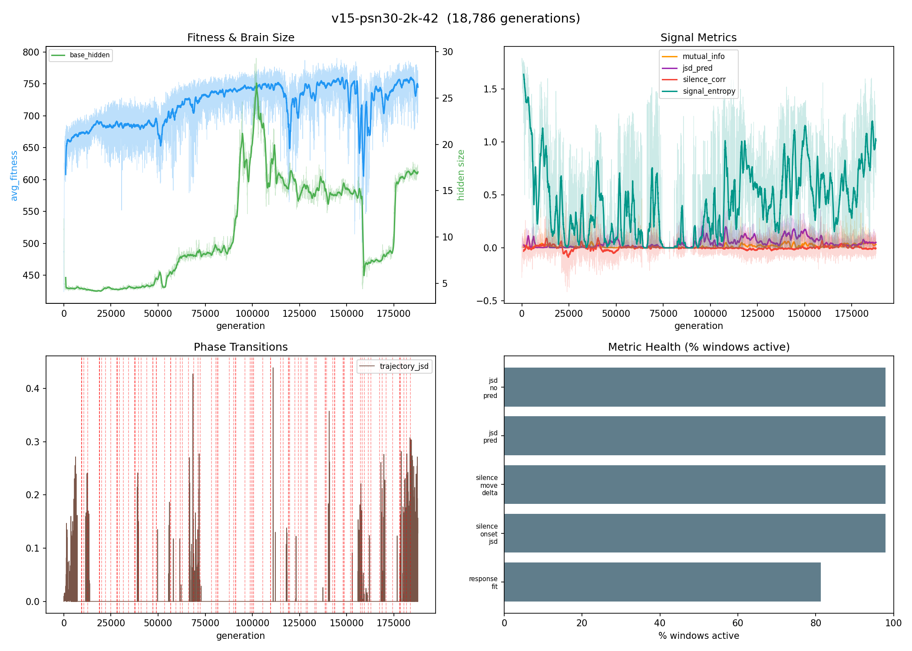
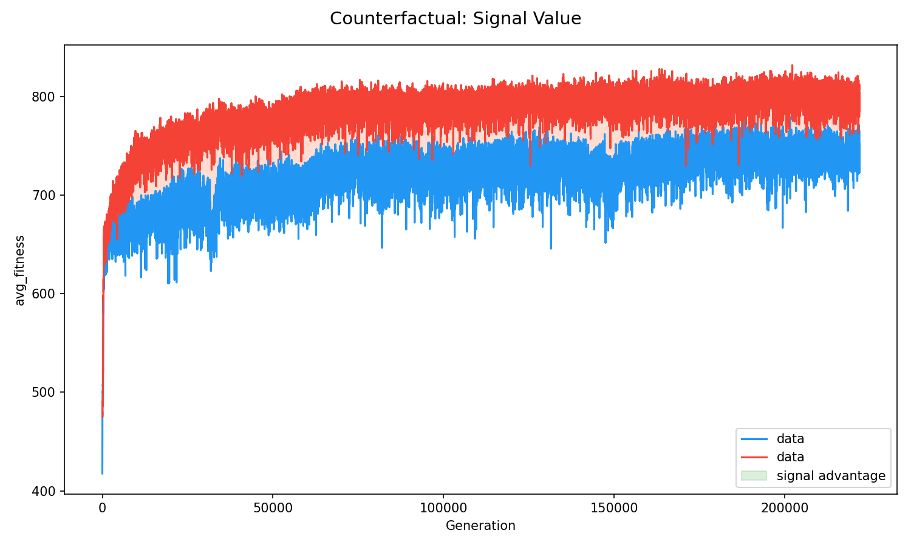

# semiotic-emergence

Every theory of signs starts from a world where meaning already exists. Peirce classifies signs that are already signs. Saussure analyzes a language that's already a language. This simulation is pointed at the gap before all of that - the moment when the universe contained no meaning and then, for the first time, it did.

Hundreds of neural networks on a toroidal grid, under invisible lethal pressure, with a 6-symbol broadcast channel. At generation zero, signals are noise. The question: **what does it look like when meaning comes into existence for the first time?**

## The answer so far

Signals emerge as a survival resource through the interaction of population scale and environmental complexity. At 384 agents, signals are net negative across every configuration tested (-8% to -25% fitness). At 5,000 agents, signals become adaptive (+0.51 correlation with survival). But the path there isn't just "add more agents" - it's environmental pressure.


*Signal vs mute fitness across experimental conditions. Signals hurt at small populations without environmental complexity. The GPU run (pop=5000) shows positive signal value.*

Adding invisible poison food (visually identical, -0.3 energy) to a 2,000-agent population produced the strongest signal quality in the project's history: receivers that differentiate behavior across symbols survive better (response_fit_corr=+0.12, 95% positive), with the first evidence of functional vocabulary stratification - a dominant beacon, a poison-correlated signal, and a rare alarm, each triggering distinct behavioral changes. The population went through a 90,000-generation evolutionary winter where brains collapsed from 24 to 7 neurons, then regrew to 17 with 10x better signal encoding. Twenty disproven hypotheses and 15 experimental eras converged on two variables: population density provides the receiver base, environmental complexity provides the selection pressure for multiple distinct messages.


*v15-2k+poison run. Top-left: fitness (blue) and brain size (green) - brains grew to 24 neurons, collapsed to 7, then regrew to 17 over ~90,000 generations. The regrown brain produced 10x higher signal MI. Top-right: signal metrics plateau after regrowth. Bottom-left: phase transitions (trajectory JSD spikes) track the collapse/regrowth cycle.*


*Mute prey (red) maintain a consistent fitness advantage over signal prey (blue) across 200k+ generations. Even with vocabulary stratification and positive response_fit_corr, signals remain net negative at 2k population - the emergence threshold lies above this scale.*

## How it works

- **Invisible kill zones** drift across the grid. Flee zones drain energy on a gradient; freeze zones penalize movement. Prey feel pain but can't see where zones are.
- **Shared-layer neural networks** (39 inputs, evolvable hidden layer 4-64 neurons) produce movement, memory updates, and 6-symbol signal emissions via a sigmoid gate. The shared architecture creates spandrel correlations that bootstrap communication.
- **Signals propagate 4x farther than vision**, making social information the only source of spatial awareness beyond a prey's immediate neighborhood.
- **Death witness inputs** create a 3-tier information chain: prey near zone deaths get directional info that others lack. Signals are the only way to relay it further.
- **Cooperative food patches** require 2+ nearby prey to harvest, rewarding spatial coordination.
- **12 metric instruments** track whether signals carry meaning (mutual information), change receiver behavior (Jensen-Shannon divergence), and couple to fitness.

## Run it

```bash
cargo run --release -- 42 1000                    # seed 42, 1000 generations
cargo run --release -- 42 1000 --no-signals       # counterfactual (signals suppressed)
cargo run --release -- 42 100000 --demes 3        # with group selection
```

Output: `output.csv` (25 columns), `trajectory.csv`, `input_mi.csv`. Analysis: `python analyze.py output.csv --plot`.

## Documentation

| Document | What's in it |
|----------|-------------|
| [FRAMEWORK.md](FRAMEWORK.md) | The semiotic theory governing this project - what meaning requires, the pre-semiotic zone, measurement instruments |
| [FINDINGS.md](FINDINGS.md) | Standing conclusions, evidence hierarchy, 20 disproven hypotheses, the metric problem |
| [EXPERIMENTS.md](EXPERIMENTS.md) | Chronological lab notebook - 15 eras, 30 runs, every parameter change and why |
| [gpu/](gpu/) | JAX/Python GPU port for large-scale experiments (pop ≤ 100k on cloud GPUs) |

## The code

~6900 lines of Rust across six files:

```
src/brain.rs      - Shared-layer NN (39 inputs, base hidden 4-64, sigmoid gate, 4 output heads)
src/evolution.rs  - Spatial evolution, deme-based group selection, lineage tracking
src/world.rs      - Grid, invisible kill zones, death echoes, poison food, energy economy
src/signal.rs     - Six symbols, configurable threshold, spatial signal grid
src/metrics.rs    - 12 instruments: MI, JSD, silence, trajectory, fitness coupling
src/main.rs       - Generation loop, CLI, checkpoint system
```

The `gpu/` directory contains a JAX/Python reimplementation designed for large-scale GPU runs (Vast.ai, Colab). It mirrors the Rust simulation's architecture and metrics, targeting populations an order of magnitude larger than the Rust CPU version can sustain.

## License

MIT
